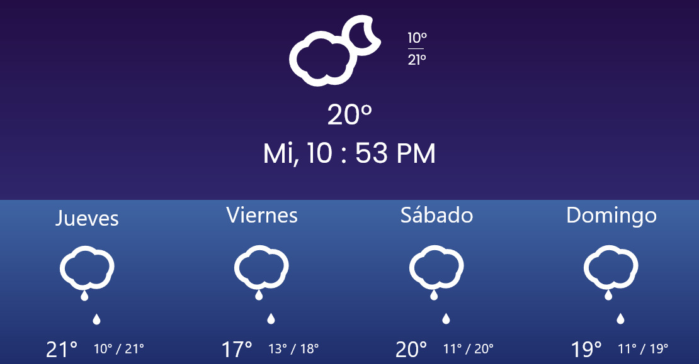

# Weather app 

## Acerca de este proyecto

-Usa la api de clima <b>openweathermap</b> para saber el clima actual y los 4 días siguientes
-Los iconos son animados gracias a <b>SkyIcons</b>
-Pide la ubicación para saber el clima de la región

---

Live: https://luisdgza.github.io/weather-app/

### Built with

- HTML
- JS
 - API openweathermap
- CSS
  - Bootstrap 4
